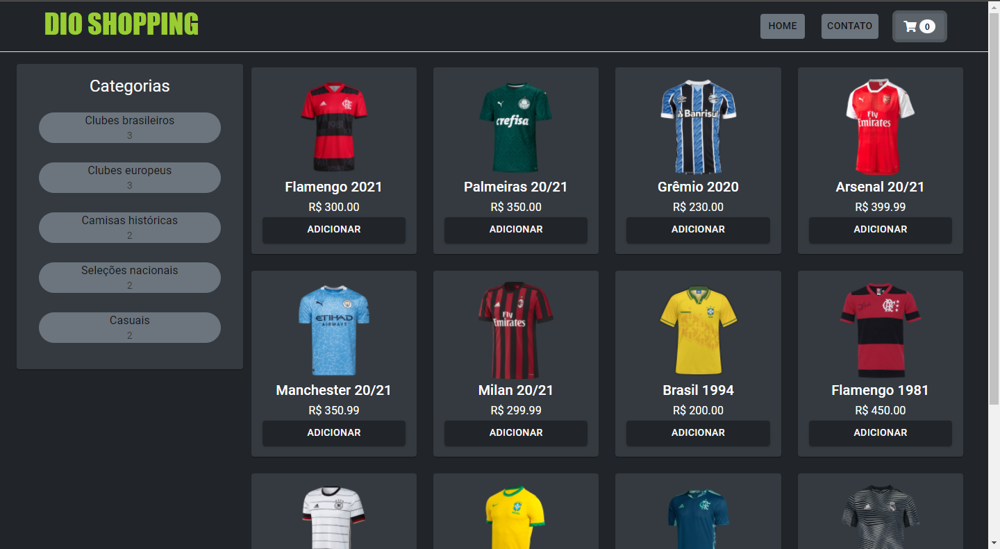

# Bootcamp Inter Frontend Developer

## E-commerce com ReactJs

- [x] corrigir imagens
- [x] inserir footer
- [x] estilizar header
- [x] substituir o botão close por finalizar compra
- [x] alterar noscript
- [x] corrigir bug do carrinho: sempre que o valor chegava a 0, não atualizava os valores no armazenamento.
- [x] verificar conexão com o servidor, evitando erros

### Iniciando a aplicação

- Clone o repositório do Backend: [nathyts/api-dioshopping](https://github.com/nathyts/api-dioshopping)
- Abra terminal no api-dioshopping e execute `yarn` e `npm run dev`
- Clone este repositório
- Abra o terminal e execute `yarn` e `yarn start`

